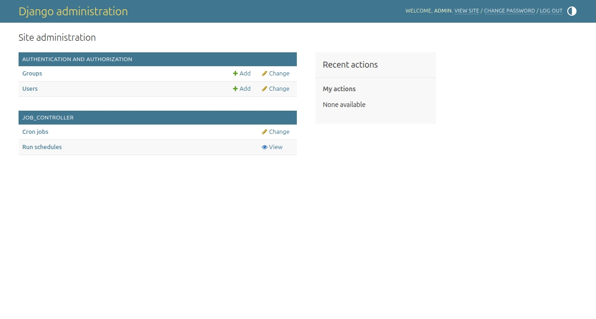
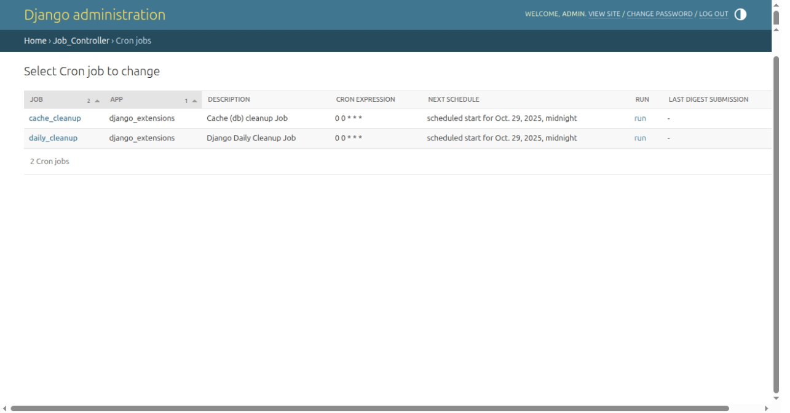
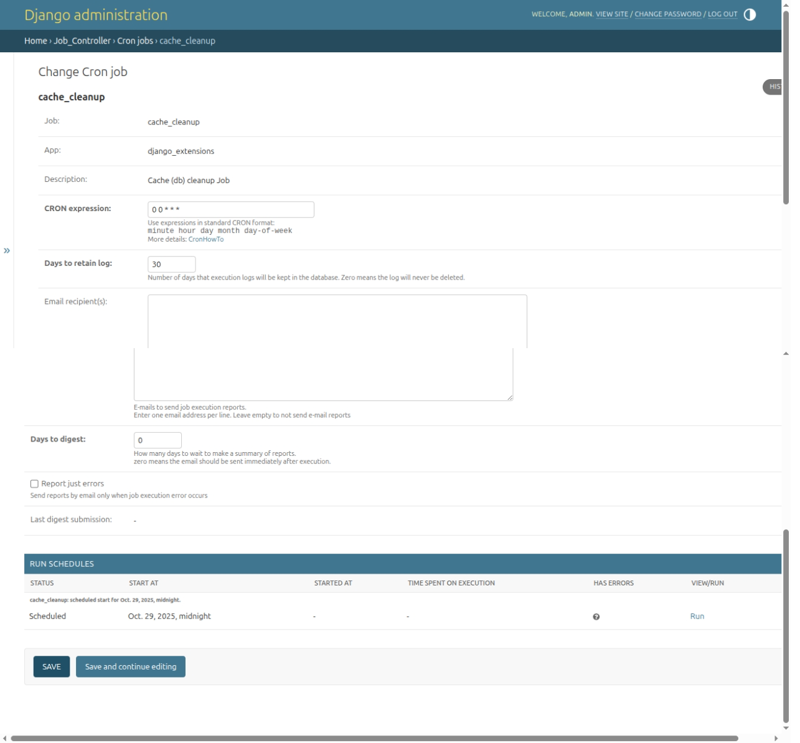
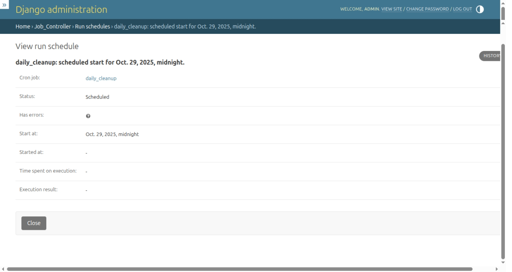

Admin interface
===============

:synopsis: Django admin interface to manage cronjobs.

Once installed, **dx-job-controller** is available in the Django admin 
interface panel with two accessible classes:

Cronjobs
--------

The ``Cronjobs`` class allows you to view and manage all existing jobs in 
the system:

The **run** column in the listview allows you to run the job immediately.

In the change form of `Cronjobs` is possible to configure the execution of 
the job (see: :doc:`managing_jobs`):

The list of job schedules is displayed as a `TabularInline`. The **view/run**
column provides the oportunity to run (if job schedule is in Scheduled status) 
or view details of scheduled execution.

Schedules
---------

The `Run schedules` listview lists all scheduled job executions. You can 
filter by `status` (scheduled, running, finished) and by `cronjob`:

.. image:: images/schedule_viewlist.png

It also has a **run** column to immediately run the scheduled job.

The schedules `View form` displays details of execution:

